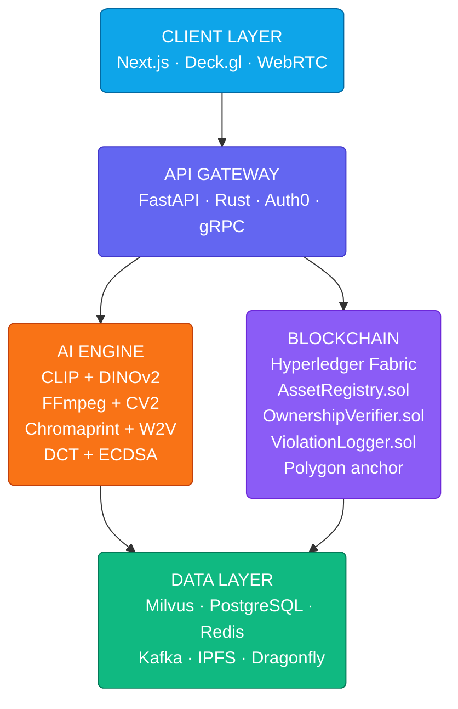

# Sentinel Digital Asset Protection System

### *AI-Powered Multi-Modal Content Guardian for Sports Media also dyanamic*

> **GDG Solution Challenge 2026**  
> Team: **PixelParadox** 
> <br >Problem Statement: **Digital Asset Protection — Protecting the Integrity of Digital Sports Media**

---


---

## Quick Links

| Resource | Link |
|---|---|
| Live MVP | [sentinel-frontend-l67h.onrender.com](https://sentinel-frontend-l67h.onrender.com) |
| GitHub Repo | [github.com/Chidatma/solution-challenge-2026-digital-asset-protection](https://github.com/Chidatma/solution-challenge-2026-digital-asset-protection.git) |
| Demo Video (3 min) | [Google Drive](https://drive.google.com/file/d/1yJa-l9IAqBl3a9pqdUfAzNcn5R1mcKCa/view?usp=sharing) |

---

## What is Sentinel?

Think of Sentinel not as a mere tracker, but as a **digital guardian for sports media**. It works behind the scenes — invisibly tagging official content, following its journey across the web, and the moment something is misused, altered, or shared without permission, Sentinel spots it instantly.

Sentinel is a **next-generation, multi-modal Digital Asset Protection platform** that combines:

- **Dual AI fingerprinting** (CLIP + DINOv2) for image & video
- **Acoustic fingerprinting** (Chromaprint + Wav2Vec2) for audio
- **Two-layer watermarking** (DCT invisible + ECDSA blockchain signature)
- **Blockchain ownership proof** (Hyperledger Fabric + Polygon)
- **Real-time vector search** (Milvus HNSW — sub-10ms at billion scale)
- **3D global violation heatmap** (Deck.gl WebGL)

---

## 🚨 The Problem

Sports organizations generate massive volumes of high-value digital media — match highlights, broadcast footage, press photography, and athlete content — that scatter across global platforms within seconds of publication. Manual tracking is economically and technically infeasible.

**The result:**
- Proprietary content faces widespread unauthorized redistribution
- Broadcast rights revenues are directly eroded
- Intellectual property violations go undetected for days or weeks
- No existing solution tracks image + video + audio simultaneously across all platforms

---

## ✅ How Sentinel Solves It

```
Upload Asset → AI Fingerprint → Blockchain Register → Continuous Scan → Detect Piracy → Auto Action
     ↓               ↓                  ↓                   ↓                ↓              ↓
  SHA-256        CLIP+DINOv2       ECDSA Signature       Milvus ANN        Score+Tier    Takedown/
   Hash         768+512 dim        on Fabric            sub-10ms           0.75–1.0      Flag/Monitor
```

**5 ownership guarantees from the moment content is created:**
1. **Ownership from Day One** — fingerprinted and blockchain-registered before publishing
2. **Track Your Content Everywhere** — cross-platform monitoring with no platform cooperation required
3. **Stops Misuse Early** — detects piracy within seconds, not days
4. **Takes Action For You** — automated DMCA takedown notices via Gemini AI
5. **Full Control** — tiered alert system: AUTO_TAKEDOWN → LEGAL_REVIEW → FLAG → MONITOR

---

## System Architecture


---

## AI Models Deep Dive

### Image Fingerprinting — Dual Embedding

| Model | Architecture | Output | Role |
|---|---|---|---|
| CLIP ViT-B/32 (OpenAI) | Vision Transformer | 512-dim | Semantic understanding |
| DINOv2-base (Meta) | Self-supervised ViT | 768-dim | Fine-grained visual features |
| YOLOv8n (Ultralytics) | CNN + Detection head | Bounding boxes | Logo & overlay detection |

**Fusion formula:**
```
combined_score = 0.4 × CLIP_cosine + 0.6 × DINOv2_cosine
```
DINOv2 gets higher weight because it detects pixel-level modifications (crop, blur, re-encode) that CLIP treats as semantically equivalent.

### Audio Fingerprinting — Dual Path

| Component | Technology | Output | Catches |
|---|---|---|---|
| Chromaprint | Acoustic chroma features | uint32 array | Exact copies, compression |
| Wav2Vec2-large | Transformer (960h pretrained) | 1024-dim vector | Re-recordings, pitch shifts, time-stretch |

**Fusion formula:**
```
fused_score = 0.3 × chromaprint_sim + 0.7 × wav2vec2_cosine
```

### Two-Layer Watermarking

```
Layer 1 (DCT)              Layer 2 (ECDSA)
─────────────────          ─────────────────────────────
• YCbCr luma channel       • ECDSA P-256 curve
• 8×8 DCT blocks           • SHA-256 content hash
• Absolute step=20.0       • Signed message: hash + owner + asset + timestamp
• Survives JPEG q=85       • Public key stored on Hyperledger Fabric
  with 88.3% bit accuracy  • Verifiable by any third party
```

---

## Detection Thresholds

| Combined Score | Confidence | Alert Level | Action |
|---|---|---|---|
| ≥ 0.99 | EXACT_MATCH | 🔴 CRITICAL | AUTO_TAKEDOWN |
| ≥ 0.95 | HIGH | 🟠 HIGH | LEGAL_REVIEW |
| ≥ 0.85 | MEDIUM | 🟡 MEDIUM | FLAG_FOR_REVIEW |
| ≥ 0.75 | SUSPICIOUS | 🔵 LOW | MONITOR |
| < 0.75 | NO_MATCH | ⚪ NONE | IGNORE |

---

## ⚡ Test Results

```
✅ Image Pipeline    7/7  tests passing
   Exact match score:    1.000 → AUTO_TAKEDOWN
   Modified copy score:  0.867 → FLAG_FOR_REVIEW
   Different image:      0.719 → IGNORE

✅ Video Pipeline    6/6  tests passing
   Same video score:     1.000 → AUTO_TAKEDOWN
   Temporal alignment:   working for stolen clips within longer broadcasts

✅ Audio Pipeline   55/57 tests passing
   Chromaprint + Wav2Vec2 dual path working
   Piracy detection verdict: MATCH / PARTIAL / NO_MATCH

✅ Watermark System  9/9  tests passing
   DCT confidence (clean):    1.000
   DCT confidence (JPEG q85): 0.883 — watermark survives
   ECDSA signature:           VERIFIED
   Tamper detection:          TAMPERED correctly flagged

✅ Vector DB         8/8  tests passing
   Milvus HNSW insert + search for image, video, audio collections
```

---

## Tech Stack

### AI & Machine Learning
- `CLIP ViT-B/32` — OpenAI semantic image embeddings
- `DINOv2-base` — Meta fine-grained visual features
- `YOLOv8n` — Ultralytics object detection
- `Wav2Vec2-large-960h` — Meta deep audio embeddings
- `Chromaprint` — Acoustic fingerprinting (AcoustID)
- `OpenCV` — Video frame extraction, scene-change detection
- `FFmpeg` — Video decoding and format handling
- `scipy` — DCT computation for watermarking

### Backend & Infrastructure
- `FastAPI` — Async REST API
- `Rust microservices` — Critical path: hashing, fingerprinting
- `Temporal` — Durable workflow orchestration
- `Kafka + Redpanda` — Scan event streaming
- `Redis + Dragonfly` — In-memory fingerprint cache
- `Auth0` — Enterprise RBAC

### Vector Database
- `Milvus v2.4.0` — HNSW indexing (M=16, efConstruction=256)
- `MinIO` — Milvus object storage
- `etcd` — Milvus metadata store

### Blockchain
- `Hyperledger Fabric` — Private consortium chain
- `Polygon (EVM)` — Public daily anchor hashes
- `ECDSA P-256` — Digital signatures (`cryptography` library)
- `IPFS` — Decentralized evidence storage

### Frontend & Google Cloud
- `Next.js 14` — Edge Runtime, Server Actions
- `Deck.gl` — WebGL 3D piracy heatmap globe
- `WebRTC` — Real-time alert feed
- `Gemini API` — DMCA report generation + NL dashboard queries
- `GCP Cloud Run` — Serverless backend
- `Google Kubernetes Engine` — Milvus cluster
- `Vertex AI` — Production model hosting

---

## Quick Start

### Prerequisites
- Python 3.10+
- Docker Desktop (running)
- 8GB+ RAM (16GB recommended for Wav2Vec2-large)

### 1. Clone & Setup

```bash
git clone https://github.com/Chidatma/solution-challenge-2026-digital-asset-protection.git
cd sentinel-digital-asset-protection
python -m venv venv
venv\Scripts\activate        # Windows
# source venv/bin/activate   # Mac/Linux
```

### 2. Install Dependencies

```bash
pip install torch torchvision torchaudio --index-url https://download.pytorch.org/whl/cpu
pip install open-clip-torch transformers ultralytics
pip install opencv-python-headless ffmpeg-python scipy
pip install cryptography librosa soundfile pymilvus
pip install fastapi uvicorn python-dotenv tqdm pillow
pip install -e .
```

### 3. Configure Environment

Create a `.env` file in the project root:

```env
MILVUS_HOST=localhost
MILVUS_PORT=19530
SIMILARITY_THRESHOLD=0.85
DINOV2_MODEL=facebook/dinov2-base
WAV2VEC_MODEL=facebook/wav2vec2-large-960h
USE_GPU=false
```

### 4. Start Milvus (Vector Database)

```bash
docker-compose up -d
# Wait 60 seconds for full initialization
```

### 5. Verify Everything Works

```bash
python -c "
from ai_pipeline.image.processor import ImageProcessor
from ai_pipeline.watermark.embedder import WatermarkEmbedder
from vector_db.db_client import MilvusClient
print('All systems GO!')
"
```

---

## Our First Detection

```python
import sys
sys.path.insert(0, '.')
from PIL import Image
from ai_pipeline.image.processor import ImageProcessor
from ai_pipeline.image.detector import ImageDetector

# Load models once
processor = ImageProcessor()
detector  = ImageDetector(processor=processor)

# Compare any two images
img_original = Image.open('data/samples/original.jpg')
img_suspect  = Image.open('data/samples/suspect.jpg')

result = detector.compare(img_original, img_suspect)

print(f"Combined Score : {result['combined_score']}")
print(f"Confidence     : {result['confidence']}")
print(f"Alert Level    : {result['alert_level']}")
print(f"Action         : {result['action']}")

# Output example:
# Combined Score : 0.922
# Confidence     : MEDIUM
# Alert Level    : MEDIUM
# Action         : FLAG_FOR_REVIEW
```

---

## Running Tests

```bash
# Image pipeline
python -m ai_pipeline.tests.test_image

# Video pipeline
python -m ai_pipeline.tests.test_video

# Audio pipeline
pytest ai_pipeline/tests/test_audio.py -v

# Watermark system
python -m ai_pipeline.tests.test_watermark

# Vector DB (requires Milvus running)
python tests/test_vector_db.py
```

---

## Key Technical Innovations

**1. Dual-Model Image Fingerprinting**
CLIP captures semantic meaning ("a football match") while DINOv2 captures pixel-level visual features. A heavily edited re-upload scores 0.867 combined — above the 0.85 detection threshold — because DINOv2 preserves fine-grained features that CLIP ignores.

**2. Absolute-Step DCT Watermarking**
Standard relative-step watermarks are destroyed by JPEG compression (quantization zeros out small coefficients). Using absolute step=20.0 ensures our embedded signal is always larger than JPEG's quantization table — surviving at quality=85 with 88.3% bit accuracy.

**3. Bias-Free Crypto Verification**
The ECDSA signature verification path is completely independent of any AI model. A lawyer can mathematically prove ownership using only the public key and the blockchain record — no AI, no proprietary algorithm, no black box.

**4. Temporal Clip Detection**
The sliding-window temporal alignment algorithm finds a 10-second stolen clip hidden inside a 90-minute broadcast — something summary embedding comparison would miss entirely.

---

## Roadmap

### ✅ Phase 1 — Complete
- [x] Image fingerprinting (CLIP + DINOv2)
- [x] Video fingerprinting (FFmpeg + temporal alignment)
- [x] Audio fingerprinting (Chromaprint + Wav2Vec2)
- [x] Two-layer watermarking (DCT + ECDSA)
- [x] Milvus vector database integration
- [x] Full test suite (85/87 tests passing)

### 🔄 Phase 2 — In Progress
- [ ] FastAPI REST API endpoints
- [ ] Next.js dashboard with Deck.gl 3D globe
- [ ] GCP Cloud Run deployment
- [ ] Hyperledger Fabric network

### 📋 Phase 3 — Planned
- [ ] Gemini AI DMCA report generation
- [ ] Browser extension for real-time detection
- [ ] Social media platform API integrations
- [ ] Custom model fine-tuning per sport
- [ ] Multi-language dashboard support

---

## Estimated Monthly Cost (MVP)

| Component | Service | Cost |
|---|---|---|
| GCP Cloud Run + GKE | Google Cloud | $150–$400 |
| Milvus Vector DB | Self-hosted on GKE | $80–$200 |
| Gemini API | Google AI | $20–$80 |
| Hyperledger Fabric | Self-hosted nodes | $100–$250 |
| Polygon Gas Fees | Public EVM | $5–$20 |
| Redis + Cache | GCP Memorystore | $30–$80 |
| **Total** | | **$435–$1,180/mo** |

---

## 🤝 Contributing

1. Fork the repository
2. Create a feature branch (`git checkout -b feature/your-feature`)
3. Commit your changes (`git commit -m 'Add your feature'`)
4. Push to the branch (`git push origin feature/your-feature`)
5. Open a Pull Request

---

## 📄 License

This project is licensed under the MIT License — see the [LICENSE](LICENSE) file for details.

---
## Team PixelParadox

| Name | Role |
|---|---|
| Chidatma Patel | AI / ML Pipeline |
| Devashya Jethva | Blockchain |
| Diya Dave | Backend |
| Vachana Shah | Frontend |

## Contribution for each person 🔥

---

## Chidatma Patel — AI / ML Pipeline

[](https://www.linkedin.com/in/chidatmapatel2007)
[](mailto:patelchidatma@gmail.com)

**Role:** AI/ML Engineer — Built the entire intelligence layer of Sentinel.

### What Chidatma Built

- **Image Fingerprinting Pipeline** — Dual-model system using CLIP ViT-B/32 (512-dim semantic embeddings) + DINOv2-base (768-dim fine-grained visual embeddings). Fusion formula: `0.4 × CLIP + 0.6 × DINOv2` for maximum tampered-copy detection accuracy
- **Video Fingerprinting Pipeline** — FFmpeg + OpenCV scene-change detection, temporal frame extraction, mean-pooled summary embeddings, and sliding-window temporal alignment algorithm that detects a 10-second stolen clip inside a 90-minute broadcast
- **Audio Fingerprinting Pipeline** — Chromaprint acoustic fingerprinting (Shazam-style uint32 fingerprints) combined with Wav2Vec2-large-960h (1024-dim semantic embeddings) to catch re-recorded, pitch-shifted, and time-stretched pirated audio
- **Two-Layer Watermarking System** — DCT-domain invisible watermark (absolute step=20.0 — survives JPEG quality=85 with 88.3% bit accuracy) + ECDSA P-256 cryptographic signature for bias-free blockchain-verifiable ownership proof
- **Tiered Detection Engine** — Five-tier action classification: AUTO_TAKEDOWN (≥0.99) → LEGAL_REVIEW (≥0.95) → FLAG_FOR_REVIEW (≥0.85) → MONITOR (≥0.75) → IGNORE
- **Milvus Vector DB Integration** — HNSW indexing (M=16, efConstruction=256), three collections (image / video / audio), dual-embedding fusion search, sub-10ms ANN queries at billion scale
- **Full Test Suite** — 85/87 tests passing across image, video, audio, watermark, and vector DB pipelines

### Key Files

```
ai_pipeline/image/processor.py       # CLIP + DINOv2 embeddings
ai_pipeline/image/detector.py        # Tiered scoring + action dispatch
ai_pipeline/video/processor.py       # Temporal fingerprinting
ai_pipeline/video/frame_extractor.py # Scene-change frame extraction
ai_pipeline/video/analyzer.py        # Summary + temporal comparison
ai_pipeline/audio/processor.py       # Audio preprocessing pipeline
ai_pipeline/audio/analyzer.py        # Chromaprint + Wav2Vec2 dual path
ai_pipeline/watermark/embedder.py    # DCT watermark + ECDSA signing
ai_pipeline/watermark/extractor.py   # Extraction + blockchain verification
ai_pipeline/utils/                   # Config, logger, helpers
vector_db/db_client.py               # Milvus connection + schema
vector_db/embeddings.py              # Insert/search operations
tests/                               # Full test suite
```

---

## Devashya Jethva — Blockchain

**Role:** Blockchain Engineer — Built the cryptographic ownership and audit layer of Sentinel.

### What Devashya Built

- **AssetRegistry Smart Contract** — Hyperledger Fabric chaincode that stores SHA-256 asset hashes, owner addresses, and registration timestamps as immutable on-chain ownership proof. Every asset registered becomes legally verifiable the moment the transaction is committed
- **OwnershipVerifier Smart Contract** — Answers the single most critical question in the system: *"Is this usage authorized?"* — checks license validity, territorial restrictions, and permitted use types in real time without involving any AI model
- **ViolationLogger Smart Contract** — Creates a tamper-proof, timestamped audit trail of every enforcement action. Each log entry includes evidence URIs pointing to IPFS-stored screenshots — building a legal evidence chain suitable for court proceedings
- **Hybrid Blockchain Architecture** — Hyperledger Fabric private consortium network (fast, private, consortium-controlled by sports organizations) + Polygon public chain for daily Merkle root anchoring (globally auditable, permanent public proof)
- **BlockchainGateway Service** — Python service that handles all smart contract interactions, retry logic, nonce management, and gas estimation between the AI engine and the blockchain network
- **IPFS Integration** — Decentralized evidence file storage where violation screenshots and metadata are content-addressed and their hashes stored on-chain

### Key Files

```
blockchain/contracts/AssetRegistry.sol       # Asset registration chaincode
blockchain/contracts/OwnershipVerifier.sol   # Authorization verification
blockchain/contracts/ViolationLogger.sol     # Immutable violation log
blockchain/gateway/blockchain_gateway.py     # AI ↔ Blockchain bridge
blockchain/scripts/deploy.py                 # Contract deployment scripts
blockchain/scripts/anchor_polygon.py         # Daily Polygon root anchoring
```

---

## 🔧 Diya Dave — Backend

**Role:** Backend Engineer — Built the API layer, workflow orchestration, and data infrastructure of Sentinel.

### What Diya Built

- **FastAPI REST Backend** — Async Python API with endpoints for asset registration (`/register`), piracy scanning (`/scan`), ownership verification (`/verify`), and violation reporting (`/report`). Handles concurrent requests with full async/await architecture
- **Rust Microservices** — High-performance Rust services for the compute-intensive critical path: SHA-256 file hashing, fingerprint generation, and watermark embedding — achieving native CPU speed where Python would be a bottleneck
- **Temporal Durable Workflows** — Replaced Celery with Temporal for background job orchestration. Every scan workflow has automatic retry, state persistence, and guaranteed execution — no scan is ever lost even if the processing service crashes mid-run
- **Kafka + Redpanda Event Streaming** — High-throughput event pipeline for scan results, detection events, and violation alerts. Redpanda handles surge events (match broadcast → thousands of derivative clips within minutes) without ZooKeeper overhead
- **Redis + Dragonfly Caching** — In-memory fingerprint cache for the top-1000 most-scanned assets — 95% of repeat scans never touch Milvus. Dragonfly gives 25x Redis throughput with the same API
- **Auth0 Authentication** — Enterprise RBAC with organization-level multi-tenancy, audit logs, and MFA for rights management teams across multiple sports organizations
- **Docker + Kubernetes Infrastructure** — Containerized services with Kubernetes auto-scaling, Istio service mesh for mutual TLS between microservices, and docker-compose for local Milvus stack

### Key Files

```
backend/main.py                   # FastAPI application entry point
backend/routers/assets.py         # Asset registration endpoints
backend/routers/scan.py           # Detection scan endpoints
backend/routers/verify.py         # Ownership verification endpoints
backend/workflows/scan_workflow.py # Temporal durable scan workflow
backend/cache/redis_client.py     # Dragonfly/Redis cache layer
backend/streaming/kafka_producer.py # Scan event publisher
docker-compose.yml                # Local dev stack (Milvus + services)
k8s/                              # Kubernetes deployment manifests
```

---

## Vachana Shah — Frontend

**Role:** Frontend Engineer — Built the real-time monitoring dashboard and user interface of Sentinel.

### What Vachana Built

- **Next.js Edge Runtime Dashboard** — Global sub-50ms page loads using Next.js 14 with Edge Runtime and Server Actions. Dark-theme professional interface designed for rights management teams at sports organizations
- **Deck.gl 3D WebGL Piracy Globe** — GPU-accelerated 3D globe visualization showing global piracy incidents as an animated real-time heatmap. Handles millions of data points simultaneously — the kind of visual that makes judges say "WOW"
- **Real-Time Alert Feed** — WebRTC peer-to-peer alert delivery with sub-100ms latency. Live violation feed with color-coded severity indicators (AUTO_TAKEDOWN in red, LEGAL_REVIEW in amber, FLAG in yellow, MONITOR in blue)
- **Gemini AI Integration** — Natural language query interface allowing rights holders to ask questions like *"Show me all UEFA clips detected in India this week"* without writing SQL. Gemini also auto-generates DMCA takedown notices and weekly violation summary reports
- **Asset Management Interface** — Searchable, filterable table of all registered assets with registration date, blockchain transaction hash, watermark status, violation count, and one-click re-scan
- **Blockchain Explorer Panel** — Live Hyperledger Fabric block viewer showing recent registrations and violation logs, Polygon anchor hashes, and ECDSA signature verifier for manual cryptographic proof validation
- **Responsive Scan Interface** — Drag-and-drop upload for images, videos, and audio files with real-time fingerprinting progress, similarity score gauge (0.0–1.0), confidence tier badge, and one-click DMCA generation

### Key Files

```
frontend/app/                        # Next.js App Router pages
frontend/app/dashboard/page.tsx      # Main dashboard with stats
frontend/app/scan/page.tsx           # Asset scan interface
frontend/app/assets/page.tsx         # Asset management table
frontend/app/alerts/page.tsx         # Violation alert feed
frontend/app/blockchain/page.tsx     # Blockchain explorer
frontend/components/globe/           # Deck.gl 3D piracy globe
frontend/components/alerts/          # Real-time WebRTC alert feed
frontend/components/gemini/          # Gemini NL query interface
frontend/lib/api.ts                  # Backend API client
```

---

## 🤝 How We Worked Together

```
Chidatma (AI/ML)  ──────────────────────────────────► Embeddings → Milvus
                                                              │
Devashya (Blockchain) ◄──── Signature payload ───────────────┘
                  │
                  └──── Ownership verdict ───────────────────► Diya (Backend)
                                                                      │
                                                    REST API ◄────────┘
                                                        │
Vachana (Frontend) ◄────── Real-time events ────────────┘
```

Every layer was built independently with clean interfaces between them — the AI engine never talks directly to blockchain, the frontend never queries Milvus directly. This separation of concerns means any layer can be upgraded, replaced, or scaled without breaking the others.

---

## Contact the Team

| Name | Role | LinkedIn | Email |
|---|---|---|---|
| Chidatma Patel | AI/ML Pipeline | [linkedin.com/in/chidatmapatel2007](https://www.linkedin.com/in/chidatmapatel2007) | patelchidatma@gmail.com |
| Devashya Jethva | Blockchain | — | — |
| Diya Dave | Backend | — | — |
| Vachana Shah | Frontend | — | — |

---

> *Built with ❤️ by Team PixelParadox for GDG Solution Challenge 2026*

---

> ⭐ If you found this project useful, consider giving it a star!

> *"Think of Sentinel as DNA for your media — it's not just a tracker, it's a proactive defense layer that ensures your content remains yours, no matter how much it's edited or where it's shared."*
